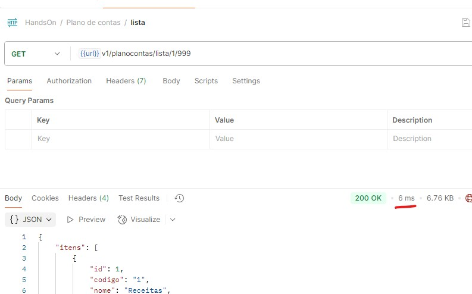

# HandsOn
Esta API tem como finalidade o suporte para cadastro de Plano de Contas.

## Tecnologia
O código foi criado com o framework .Net 8.0, com padrão [.Net Aspire](https://learn.microsoft.com/pt-br/dotnet/aspire/get-started/aspire-overview).

Foi empregado minha interpretação de Clean Architecture e seguido os conceitos de SOLID.
A API segue os padrões RestFul e stateless.

### Projeto
A solution possuí os seguintes projetos:
- HandsOn.Api - Web API a ser publicado no host
- HandsOn.Api.Tests - Projeto para testes unitários
- **HandsOn.AppHost** - Orquestrador do Aspire, ponto inicial para rodar local
- HandsOn.Dto - Objetos DTOs
- HandsOn.Regras - Camada de regras de negócios
- HandsOn.Repositorio - Camada de repositórios
- HandsOn.ServiceDefaults - Projeto base para inicialização de aplicações Aspire

### Como rodar
Para rodar local, se faz necessário o SDK .Net 8 e adicionar algumas chaves no appsettings.Development.json ou "User Secrets". Por questão de segurança, essas chaves não foram incluídas no Git. O conteúdo necessário foi enviado por e-mail.

### Banco de dados
O projeto está configurado para utilizar um Sql Server Azure em minha conta pessoal. Podem utilizar para os testes.

### Chamando a API
Para facilitar, o projeto está publicado na Azure no seguinte endereço: https://handson-deckbrckehakd3bw.centralus-01.azurewebsites.net/

Para realizar as chamadas, é possível utilizar o Swagger (/swagger) ou baixe a coleção Postman [aqui](/HandsOn.postman_collection.json)

A primeira requisição deve ser para gerar o token OAuth2 em /seguranca/token, o client_id e client_secret foram enviados por e-mail.

### Performance
O código segue os melhores padrões que conheço para garantir performance e baixo consumo de CPU e memória (escalável).

Se utilizarem no meu host (aplicação e/ou banco), levem em consideração que os servidores são de nível gratuito e estão fisicamente em Central US.

Executando aplicação e banco local o endpoint de lista executa em **6ms**

